# Primera impresión usando Claude

Este documento reúne una serie de ideas, reflexiones y procesos sobre cómo pensé y desarrollé mi portfolio personal utilizando Claude como apoyo durante la creación.

La intención no es mostrar únicamente el resultado final, sino también documentar cómo fui construyendo cada idea, refinando prompts y tomando decisiones de diseño mientras experimentaba con inteligencia artificial.

> Mi primera impresión utilizando Claude para crear un proyecto real.


*Imagen Tomada De: https://es.wikipedia.org/wiki/Claude_%28chatbot%29*


---


## Tabla de Contenido

1. [Instalación](#instalación)

2. [Debo pensar: ¿Qué quiero hacer?](#debo-pensar-qué-quiero-hacer)

3. [Mi razonamiento al construir el prompt](#mi-razonamiento-al-construir-el-prompt)

4. [Prompt Final](#prompt-final)

5. [Resultados](#resultados)


---


## Instalación

Para este proyecto decidí probar Claude, una herramienta de inteligencia artificial desarrollada por Anthropic.  
Había escuchado sobre el modelo anteriormente, especialmente por su enfoque en generación de código, análisis de texto y asistencia durante procesos creativos y de desarrollo.

Recomiendo mucho visitar:

* [https://claude.ai/](https://claude.ai/ "https://claude.ai/")

* [https://www.anthropic.com/](https://www.anthropic.com/ "https://www.anthropic.com/")

Quise experimentar personalmente cómo se sentía utilizar esta herramienta dentro de un flujo real de trabajo para diseñar y estructurar mi portfolio.

1. Al instalar Claude, la aplicación se ve así:

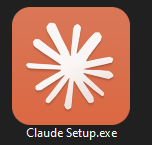

2. Luego de ejecutar la aplicación y finalmente, al abrir la interfaz principal:

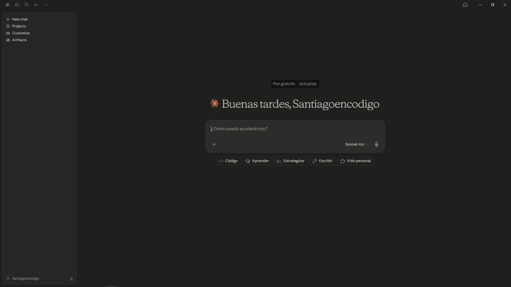

> Lo primero que me llamó la atención fue el diseño de la interfaz y la estética de los colores.

La interfaz transmite una sensación bastante elegante y moderna.  

> Si algún día desarrollara una aplicación con una identidad visual similar, probablemente intentaría conservar esa misma sensación minimalista y sobria.

También me hizo pensar en algo curioso:  

* ¿Cuántas personas realmente conocen Claude?  

* ¿Cuántas personas lo utilizan diariamente para programar, escribir o construir proyectos?

Aunque herramientas como ChatGPT suelen ser mucho más conocidas públicamente, Claude termina siendo una inteligencia artificial bastante interesante, especialmente para procesos creativos y estructuración de ideas complejas.

Ahora quería probar algo más ambicioso.

Mi idea era intentar desarrollar una página completa utilizando inteligencia artificial como apoyo principal durante el proceso.  
Y apareció una pregunta interesante:

> ¿Realmente es posible construir un proyecto relativamente complejo únicamente a partir de prompts bien estructurados?


---


## Debo pensar: ¿Qué quiero construir?

Quería modificar un repositorio en el que ya había trabajado anteriormente.  

Desde hace tiempo tenía la idea de crear una página que funcionara como la digitalización de diferentes diarios, ideas y proyectos que alguna vez escribí o desarrollé en la vida real.

Pero mientras pensaba en ello, entendí que realmente no quería hacer únicamente una “página personal”.

Quería empezar a construir una identidad.

Una especie de marca personal enfocada en mí como programador bajo el nombre de **"santiagoencodigo"**.

Por eso sentí que este proyecto terminaría siendo el primer paso de algo más grande.  

Ya no sería solamente “Santiago Muñeton haciendo una página”, sino un proyecto construido alrededor de una identidad digital más definida.

Además, quería alejarme un poco del estilo tan formal que había manejado anteriormente en proyectos como: [https://santiagoencodigo.github.io/Desarrollo-Web-Profesional/](https://santiagoencodigo.github.io/Desarrollo-Web-Profesional/ "https://santiagoencodigo.github.io/Desarrollo-Web-Profesional/")

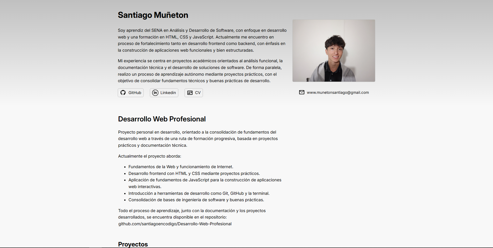

En el pasado también había desarrollado otro portfolio relacionado con competencias tipo WorldSkills, aunque visualmente seguía una línea mucho más tradicional.

Entonces decidí reorganizar completamente el proyecto y crear el primer release del nuevo repositorio:

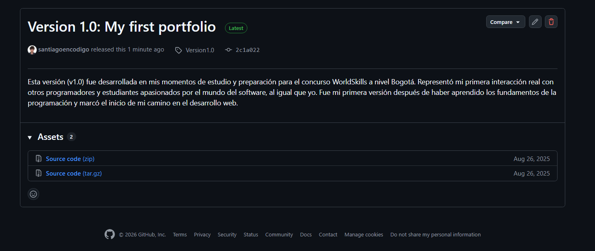

> Modifiqué el nombre del repositorio de `portfolio-santiagoencodigo` a simplemente `portfolio`.

Este nuevo repositorio almacenaría una versión mucho más personal de mí:

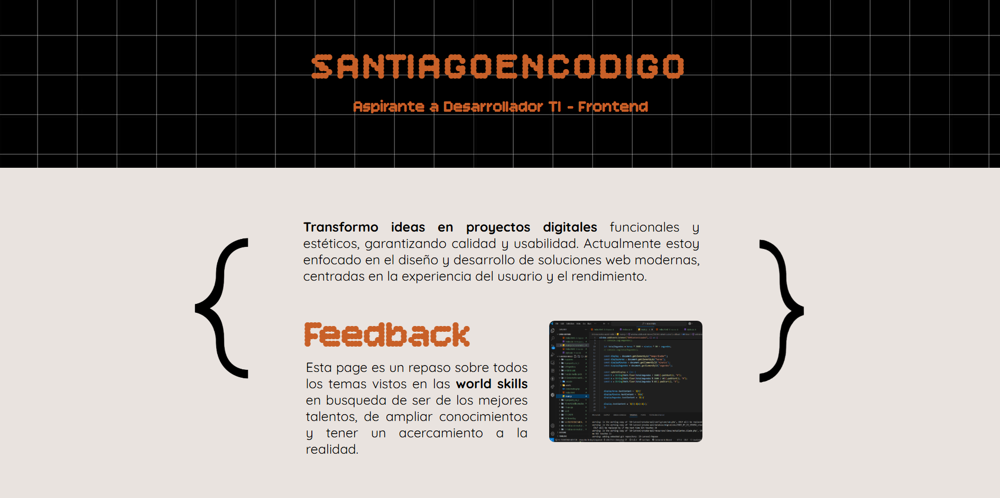

Ya no se trataba únicamente de mostrar proyectos. 

También quería incluir información sobre:

- quién soy,

- qué he estudiado,

- cuál es mi visión,

- qué tipo de proyectos he desarrollado,

- y cómo las personas podrían contactarme.

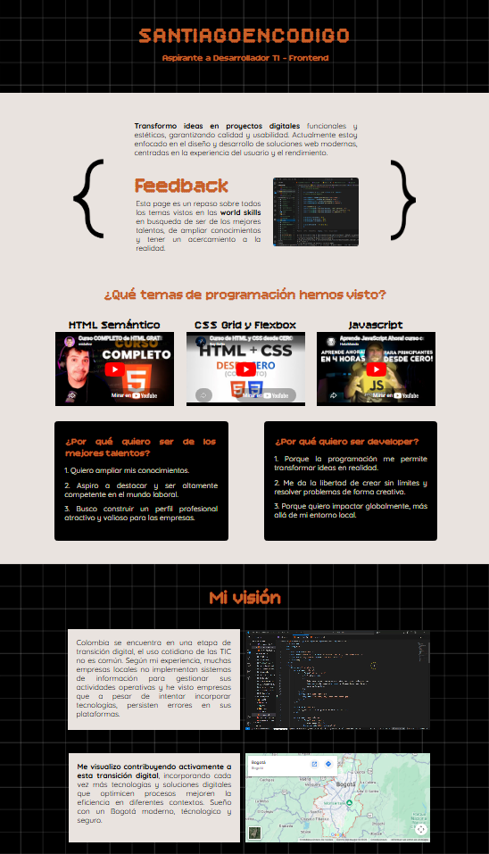

Y posteriormente:

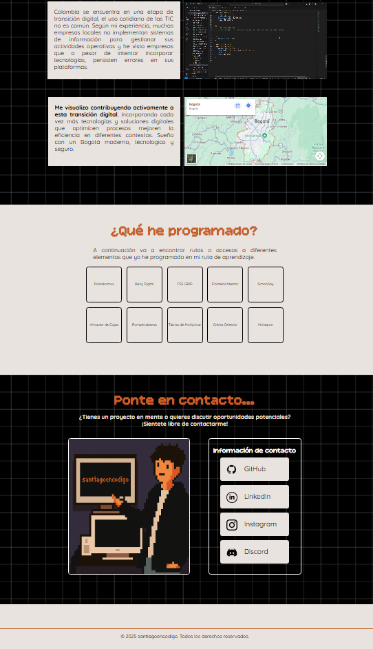

Mientras pensaba en todo esto, apareció otra idea importante:

> ¿Cómo debería verse realmente esta página?

Entonces empecé a analizar referencias visuales y estructuras de páginas ya existentes para entender qué tipo de experiencia quería construir.

Una de las páginas que más me llamó la atención fue: [https://www.skeletonoficial.com/](https://www.skeletonoficial.com/ "https://www.skeletonoficial.com/")

Y ahí surgieron varias preguntas interesantes:

> ¿Qué tan válido es inspirarse en el diseño de otra página?

> ¿Es algo normal dentro del mundo profesional?

Personalmente, me llamó muchísimo la atención la forma en que manejaban el scroll, las transiciones y la sensación visual del sitio.  
No se sentía como una página convencional, sino como una experiencia visual diseñada alrededor de la identidad de una marca.

Y justamente eso era lo que quería lograr.

Por esa razón, decidí empezar a escribir descripciones detalladas sobre cada sección que observaba:

- qué me gustaba,

- qué quería conservar como inspiración,

- qué quería modificar,

- y cómo imaginaba adaptarlo a mi propio estilo.

La idea era transformar todas esas observaciones en prompts cada vez más detallados y refinados para construir una dirección visual mucho más clara.


---


## Mi razonamiento al construir el prompt

Para ir refinando cada vez más el prompt principal, seguí una secuencia de ideas y preguntas que fui desarrollando poco a poco.  

* Cada iteración consistía en modificar, complementar y detallar aún más el texto anterior.

La idea no era simplemente escribir un prompt largo, sino construir una descripción lo suficientemente precisa como para transmitir exactamente la experiencia, estructura y estética que quería para la página.

### 1. ¿Qué secciones puede tener mi página?

> Inicialmente me basé en la apariencia y estructura visual de Skeleton.

Primero empecé describiendo cada una de las secciones que imaginaba para la página una vez tuve más claro qué quería construir.

Quería analizar:
- cómo debía sentirse la página,
- qué tipo de estructura tendría,
- cómo funcionaría el scroll,
- qué secciones deberían existir,
- y qué experiencia quería generar visualmente.

Para mejorar la redacción de esas ideas, decidí apoyarme en inteligencia artificial.

Mi proceso consistía en:
1. Tomar capturas de pantalla de las secciones que me llamaban la atención.
2. Escribir un párrafo explicando qué me gustaba de esa sección.
3. Explicar qué elementos quería conservar y cuáles quería ignorar.
4. Pedirle a la IA que transformara esa idea en una descripción mucho más clara y estructurada.

Para esto utilicé Gemini, creando conversaciones separadas para cada iteración del proceso y utilizando el modelo en modo “Fast”.


*Imagen tomada de: https://theinfinityhk.com/en/products/gemini-advanced-%28with-veo%29*

Generalmente utilizaba instrucciones similares a esta:

> “Estoy buscando redactar un prompt bien estructurado que me ayude a desarrollar una página visualmente impactante. Estoy tomando inspiración de algunas secciones que encontré interesantes. Ayúdame a describir mejor esta estructura de acuerdo a la información que voy a darte.”

A partir de ahí continuaba agregando:
- descripciones visuales,
- ideas de diseño,
- comportamientos de scroll,
- referencias estéticas,
- y detalles sobre qué elementos debía ignorar o reinterpretar.

La intención era convertir ideas abstractas en descripciones técnicas mucho más precisas.

---

### 2. Luego pensé: ¿Qué quiero construir realmente?

> Recordé que ya tenía un repositorio relacionado con el portfolio de “santiagoencodigo”.

Entonces entendí que el proyecto no debía ser únicamente una página para mostrar proyectos.

También quería construir:
- una identidad visual,
- una marca personal,
- y un espacio donde pudiera presentar ideas, escritos y proyectos propios.

La idea de “digitalizar mis diarios” empezó a tomar fuerza dentro del concepto del portfolio.

Ya no era únicamente un portafolio profesional.  
También era una representación de cómo pienso, qué construyo y cómo veo la tecnología.

---

### 3. Refinando ideas con Grok

Después empecé a utilizar Grok para seguir refinando cada párrafo y organizar mejor las ideas del proyecto.


*Imagen tomada de: https://es.wikipedia.org/wiki/Archivo:Grok_logo_%282023-2025%29.svg*

En este punto entendí algo importante:

> Debía empezar a construir el repositorio desde mi identidad personal.

Y eso me llevó a nuevas preguntas:

- ¿Qué colores representan lo que quiero transmitir?
- ¿Qué imágenes debería utilizar?
- ¿Qué sensación visual quiero generar?

---

### 4. ¿Qué colores e imágenes voy a usar?

Para construir la identidad visual del proyecto utilicé [Colorhunt](https://colorhunt.co/ "https://colorhunt.co/") como referencia para explorar diferentes paletas de colores.

Quería que la mayoría de tonos fueran oscuros porque buscaba transmitir:
- elegancia,
- misterio,
- tensión visual,
- y una sensación más cinematográfica o editorial.

Después de analizar varias combinaciones, seleccioné dos paletas principales y le pedí a Grok que me ayudara a estructurar variables CSS teniendo en cuenta:
- colores base,
- hover,
- focus,
- active,
- bordes,
- superficies,
- y jerarquías visuales.

> En este punto tuve que abrir el repositorio directamente en otra ventana de Visual Studio Code para empezar a conectar todas las ideas con una estructura real.

Por otro lado, también empecé a revisar antiguos proyectos y tomé capturas de distintos trabajos de programación que había realizado en diferentes momentos.

> Las imágenes debían representar proyectos reales de mi portfolio y también elementos relacionados con mi identidad como “santiagoencodigo”.

Estas imágenes terminaron siendo muy importantes para:
- fondos,
- galerías,
- y la presentación visual de los proyectos dentro del portfolio.

---

### 5. ¿Cuál será la estructura de archivos?

Cuando ya tenía más clara la idea general, necesitaba organizar el proyecto técnicamente.

Para ello le envié capturas del repositorio a Grok y le pedí ayuda para redactar y estructurar una posible arquitectura de archivos que tuviera sentido con el tipo de página que quería construir.

---

### 6. Integrando toda la información

Una vez tuve:
- colores,
- imágenes,
- secciones,
- referencias visuales,
- estructura,
- y comportamiento de la página,

solo faltaba integrar el contenido real.

Entonces empecé a combinar:
- información de mi CV,
- textos personales,
- descripciones que había ido refinando,
- ideas obtenidas durante las iteraciones,
- y fragmentos de antiguos archivos HTML.

La intención era que el prompt final tuviera suficiente contexto como para generar una página mucho más cercana a la idea que realmente tenía en mente.

Y finalmente terminé construyendo algo así:

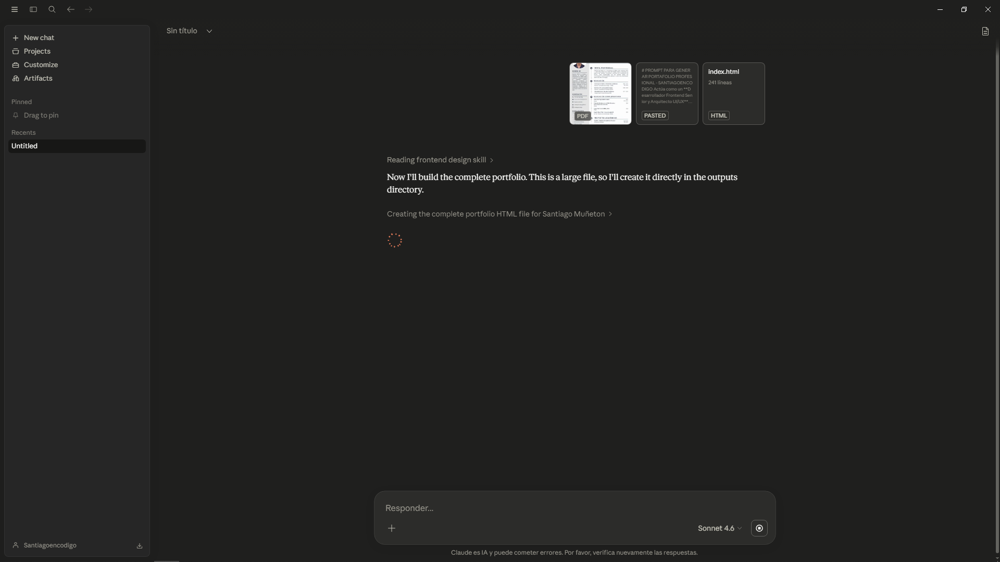


---


## Prompt Final

# PROMPT PARA GENERAR PORTAFOLIO PROFESIONAL - SANTIAGOENCODIGO

Actúa como un **Desarrollador Frontend Senior y Arquitecto UI/UX**. Necesito que generes el código completo y funcional (HTML, CSS y JavaScript) para un portafolio personal de desarrollador de software.

## 1. DIRECTRICES GENERALES Y ESTILO
- **Estética:** Dark Minimalist / Streetwear / Editorial Técnico.
- **Tecnologías:** HTML5, CSS3 (Flexbox, Grid, Animaciones) y JavaScript Vanilla (ES6). Utiliza **GSAP ScrollTrigger** para las animaciones de scroll horizontal si es necesario, o una implementación robusta con Intersection Observer y CSS Scroll Snap.
- **Responsive:** Totalmente adaptado a móviles, tablets y desktop.
- **Contenido:** Debes reemplazar todos los textos de placeholder con la información real proporcionada en las secciones 3 y 4 de este prompt (basada en el CV y proyectos previos de Santiago Muñeton).

## 2. SISTEMA DE DISEÑO (CSS OBLIGATORIO)

Utiliza estrictamente esta paleta de colores y tipografías:

```css
    :root {
    /* Fondos */
    --color-bg: #0a0a0a;
    --color-surface: #121212;
    --color-card: #1c1c1c;
    --color-panel: #252525;

    /* Grises */
    --gray-950: #0f0f0f;
    --gray-900: #1a1a1a;
    --gray-800: #252525;
    --gray-700: #333333;
    --gray-600: #4a4a4a;
    --gray-500: #6b6b6b;
    --gray-400: #999999;
    --gray-300: #b8b8b8;
    --gray-200: #d4d4d4;
    --gray-100: #eeeeee;

    /* Acentos */
    --color-primary: #0b4eff;
    --color-primary-dark: #0a2b99;
    --color-secondary: #6b4e9c;
    --color-accent-teal: #8fb8b0;

    /* Textos */
    --color-text: #f8f8f8;
    --color-text-secondary: #c0c0c0;
    --color-text-muted: #8a8a8a;
    --color-text-hover: #ffffff;
    --color-text-active: #0b4eff;
    --color-text-focus: #6b4e9c;

    /* Bordes */
    --color-border: #2c2c2c;
    --color-border-light: #3a3a3a;
    }

    /* Patrón de cuadrícula para fondos (aplica a la clase .grid-bg) */
    .grid-bg {
    background:
        calc( .9*32px) calc( .9*32px)/calc(2*32px) calc(2*32px) conic-gradient(at 20% 20%,#0000 75%,#6b6b6b 0),
        calc(-.1*32px) calc(-.1*32px)/calc(2*32px) calc(2*32px) conic-gradient(at 20% 20%,#0000 75%,#6b6b6b 0),
        calc( .7*32px) calc( .7*32px)/calc(2*32px) calc(2*32px) conic-gradient(at 40% 40%,#0000 75%,#0F0F0F 0),
        calc(-.3*32px) calc(-.3*32px)/calc(2*32px) calc(2*32px) conic-gradient(at 40% 40%,#0000 75%,#0F0F0F 0),
        conic-gradient(from 90deg at 20% 20%,#6b6b6b 25%,#0F0F0F 0) 0 0/32px 32px;
    }

    /* Tipografías */
    @import url('https://fonts.googleapis.com/css2?family=Bitcount+Grid+Double:wght@100..900&family=Cormorant+Garamond:ital,wght@0,300..700;1,300..700&family=Playfair+Display:ital,wght@0,400..900;1,400..900&display=swap');

    .font-title { font-family: "Bitcount Grid Double", system-ui; } /* Títulos importantes */
    .font-body { font-family: "Playfair Display", serif; } /* Texto normal */
    .font-label { font-family: "Cormorant Garamond", serif; } /* Texto sutil/técnico */
}
```

## 3. ESTRUCTURA SECUENCIAL DE LA PÁGINA (ARQUITECTURA)

Debes construir la página siguiendo este orden exacto de secciones:

### SECCIÓN A: Navegación Superior (Sticky)

Izquierda: Reloj funcional en tiempo real (HH:MM:SS).

Centro: Logo "SANTIAGOENCODIGO" o "SMC".

Derecha: Enlaces: 'Portfolio', 'Skills', 'Visión', 'Contacto' (Smooth scroll).

Comportamiento: Fondo transparente que se vuelve sólido (--color-surface) al hacer scroll.

---

### SECCIÓN B: Barra Lateral de Identidad (Sidebar Left - 20-25% width)

Superior: Icono/Logo secundario.

Medio: Imagen placeholder (puede ser la silueta pixel art o una foto abstracta).

Texto Animado: Efecto "typing" que rote entre: "Desarrollo a medida", "Innovación Digital", "Soluciones Full-Stack".

Inferior: Botón VER CATÁLOGO → (enlaza a la sección de proyectos).

---

### SECCIÓN C: Hero Principal (Carousel Fullscreen)

Dimensiones: Ancho restante (75-80%), Alto 100vh.

Imágenes: Carrusel automático (5s) con transición cross-fade.

Overlay: Filtro oscuro (background: rgba(0,0,0,0.4)) sobre las imágenes.

Contenido sugerido para imágenes: Placeholders abstractos oscuros o screenshots de código.

---

### SECCIÓN D: Scroll Horizontal de Proyectos Destacados (Catálogo Técnico)

Comportamiento: Al llegar a esta sección con scroll vertical, la página se "bloquea" y el scroll se transforma en horizontal (Usa GSAP ScrollTrigger o CSS Scroll Snap + JS).

Snapping: scroll-snap-type: x mandatory. Cada card debe ajustarse al centro.

Diseño de Cards:

- Formato Poster (Alto casi 90vh, Ancho 80vw).
- Imagen de fondo con overlay degradado.
- Footer: Nombre del proyecto a la izquierda, Tecnología usada a la derecha (fuente técnica).
- Hover: Zoom en la imagen + aparece un texto "VER DETALLES".

---

### SECCIÓN E: Fullscreen Manifiesto (Sección de Impacto)

Fondo: Imagen a pantalla completa con background-size: cover + Overlay oscuro al 60%.

Contenido Central:

- Icono: PNG de silueta (filtro blanco/ruido).
- Texto: "EXISTENCIAS LIMITADAS. DISEÑADO PARA QUIENES NO SIGUEN LAS REGLAS." (Letras espaciadas).
- Botón CTA: EXPLORAR UNIVERSO → (Fondo blanco, texto negro, hover invertido).

Footer de la sección: Textos pequeños en esquinas: AUTÉNTICO CÓDIGO // 2026.

---

### SECCIÓN F: Manifiesto Editorial + Grid Caótico de Proyectos

Esta sección tiene 2 sub-partes:

#### Layout Editorial (2 Columnas)

Izquierda:
- Label / MANIFIESTO //
- Título: ESTO ES SANTIAGOENCODIGO (usar Bitcount)
- Párrafos con la filosofía del desarrollador (tomada de los HTML antiguos)
- Botón: EXPLORAR PROYECTOS →

Derecha:
- Imagen vertical destacada con marco técnico.

#### Grid Caótico (Catálogo de Proyectos)

Layout:
- CSS Grid con algunas cards ligeramente desplazadas verticalmente (usando `:nth-child(even) { margin-top: 20px; }`).

Contenido de Cards:
- Imagen de fondo
- Título
- Pequeño ícono de código

#### Modal / Interacción

Al hacer clic en "VER DETALLES" (de la sección D o F), se abre un modal con:

- Nombre del proyecto.
- Descripción (Cómo fue pensado).
- Selector de imágenes: Números del 1 al 5. Al hacer clic, la imagen principal del modal cambia con una animación suave.

---

### SECCIÓN G: Órbita Celestial + Contacto

Fondo: Malla técnica (`.grid-bg`).

Superior:
- Animación CSS de Sistema Solar (Sol, Tierra, Luna en órbita). Altura reducida (~400px).

Inferior:

Título gigante: `santiagoencodigo`.

#### Layout de Contacto (2 columnas)

Izquierda:
- Imagen Pixel Art de Santiago (extraída del HTML antiguo).

Derecha:
- Lista de botones de contacto (GitHub, LinkedIn, Instagram, Discord) con iconos y texto.
- Efecto hover de elevación.

---

## 4. CONTENIDO REAL A INTEGRAR (REEMPLAZAR PLACEHOLDERS)

No uses "Lorem Ipsum". Utiliza exactamente la siguiente información extraída de los archivos del usuario:

### PERFIL PROFESIONAL (Usar en Sección F - Manifiesto)

```text
"Aprendiz SENA en Análisis y Desarrollo de Software, con conocimientos en HTML, CSS y JavaScript, y formación continua en desarrollo backend. Experiencia académica en análisis funcional, documentación técnica y apoyo a soluciones de software orientadas al entorno empresarial. Destaco por el compromiso, la adaptabilidad y el aprendizaje continuo para aportar valor. Me destaco en el área de frontend, diseño y estructuras de páginas web atractivas, funcionales y centradas en la experiencia del usuario."
```

### VISIÓN (Usar en Sección F - Columna Editorial)

```text
"Colombia se encuentra en una etapa de transición digital. Me visualizo contribuyendo activamente a esta transición, incorporando cada vez más tecnologías y soluciones digitales que optimicen procesos y mejoren la eficiencia. Sueño con un Bogotá moderno, tecnológico y seguro."
```

### LISTA DE PROYECTOS PARA EL CATÁLOGO

Debes usar esta lista de proyectos reales del usuario (Título y descripción corta). Las imágenes pueden ser placeholders estéticos (abstractos oscuros) o screenshots si los proporciona.

- Palíndromos: Verificador de palabras capicúa.
- Reloj Digital: Interfaz de hora en tiempo real.
- CSS Grid Práctica: Maquetación avanzada.
- Interactive Rating (Frontend Mentor): Componente de calificación.
- Simon Says: Juego de memoria secuencial.
- Almacén de Cajas: Sistema de inventario lógico.
- Rompecabezas: Juego interactivo de arrastre.
- Tablas de Multiplicar: Generador interactivo.
- Mokepon: Juego de combate por turnos.
- Google Clone: Clon de la interfaz de búsqueda.
- Portfolio Personal: Primer diseño de portafolio.

### INFORMACIÓN DE CONTACTO (Sección G)

- Email: www.munetonsantiago@gmail.com
- GitHub: santiagoencodigo
- LinkedIn: Santiago Muñeton Hernandez
- Instagram: santiagoencodigo
- Discord: santiagoencodigo

---

## 5. ENTREGABLES ESPERADOS

- Código: Un solo archivo `index.html` con estilos embebidos (`<style>`) o un bloque `<style>` muy limpio y JavaScript no intrusivo.
- Calidad: Código semántico, accesible, con animaciones fluidas (`cubic-bezier`).
- Funcionalidad: El reloj debe funcionar. El scroll horizontal debe ser perfecto. Los modales deben abrirse y cerrarse.

Genera el código completo a continuación.


---


## Resultados

Una vez terminé de estructurar el prompt y reunir toda la información necesaria, decidí enviarlo finalmente a Claude para comprobar hasta qué punto podía generar una experiencia visual cercana a la idea que tenía en mente.

El resultado fue bastante interesante.

Aunque posteriormente terminé modificando pequeños detalles manualmente, la estructura general, la dirección visual y gran parte de la estética inicial fueron generadas correctamente a partir del prompt.

---

### Inicio de la página

La sección principal logró transmitir bastante bien la estética oscura y editorial que estaba buscando.

Se generó:
- una navegación minimalista,
- una estructura dividida,
- un hero visual,
- y una identidad mucho más cercana a lo que imaginaba para “santiagoencodigo”.

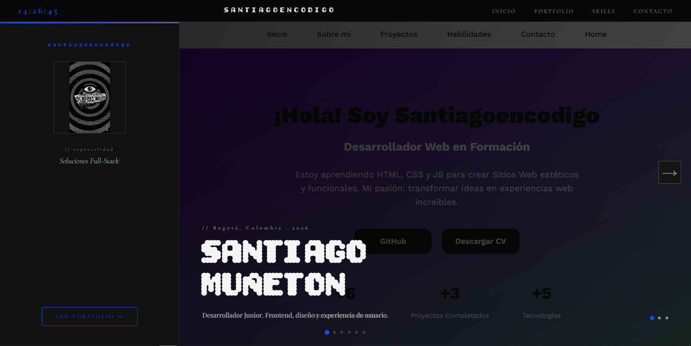

---

### Sección de proyectos destacados

Una de las partes más interesantes fue la implementación del catálogo horizontal de proyectos.

El comportamiento del scroll, las tarjetas tipo poster y el estilo visual oscuro ayudaron bastante a generar esa sensación de “catálogo técnico” que quería transmitir.

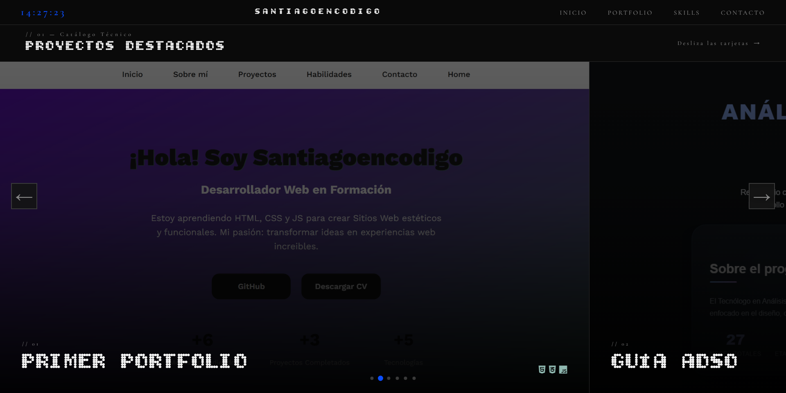

---

### Sección “Existencias Limitadas”

La IA también logró interpretar correctamente la intención visual de una sección más cinematográfica y de impacto.

Esta parte terminó convirtiéndose en una de las secciones que más me gustaron visualmente debido al contraste, tipografía y composición.

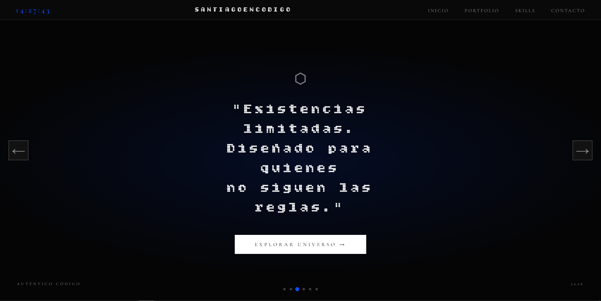

---

### Catálogo completo de proyectos

Posteriormente se generó una sección más amplia para visualizar diferentes proyectos del portfolio.

La estructura tipo grid, el manejo de espacios y las imágenes ayudaron bastante a construir una sensación más moderna y experimental.

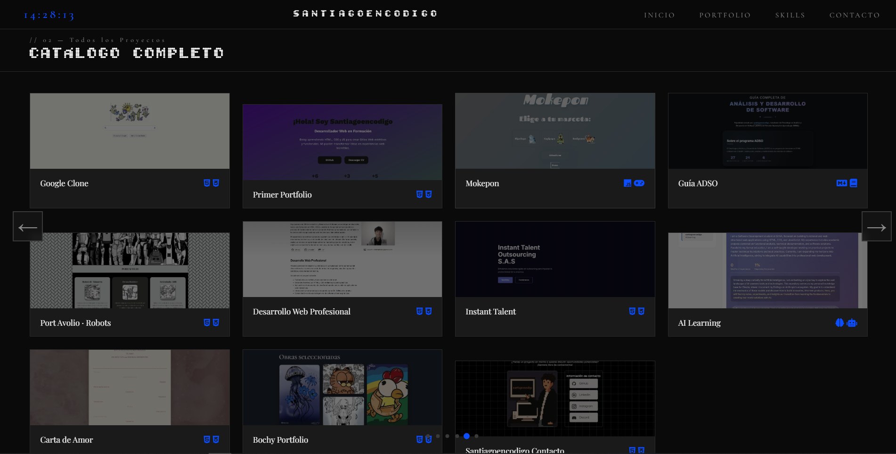

---

### Identidad visual de “santiagoencodigo”

Otra parte importante fue cómo empezó a tomar forma una identidad visual mucho más clara alrededor del proyecto.

Ya no se sentía únicamente como una página para mostrar proyectos, sino como algo más cercano a una marca personal o identidad digital.

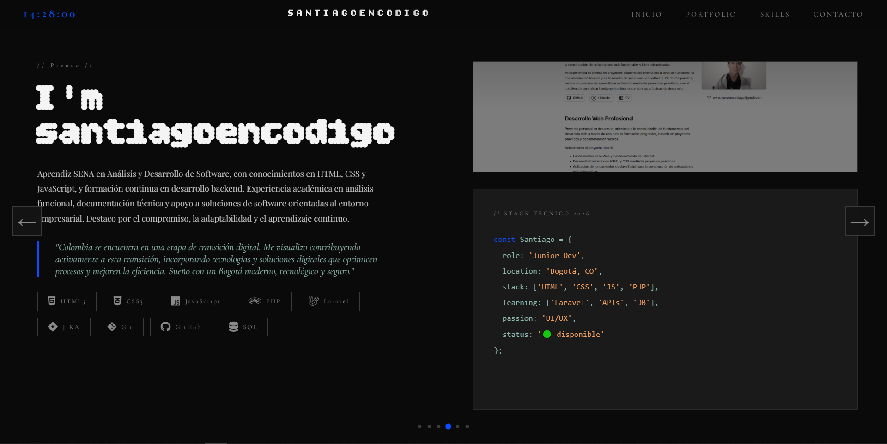

---

### Sección final y contacto

Finalmente, la página terminaba con una sección de cierre y contacto mucho más visual de lo que inicialmente esperaba.

El uso de tipografías grandes, composición oscura y elementos gráficos ayudó bastante a mantener la coherencia estética del proyecto completo.

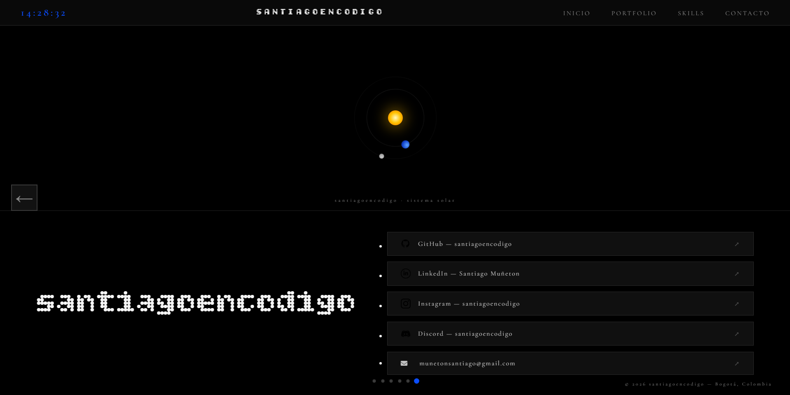

---

## Reflexión final

Lo más interesante de todo el proceso fue entender que el resultado no dependía únicamente de “pedir código”.

La calidad del resultado estaba completamente relacionada con:
- qué tan detallado era el prompt,
- qué tan clara era la idea,
- qué referencias visuales utilizaba,
- y cuánto refinamiento hacía en cada iteración.

Más que generar una página automáticamente, sentí que estaba dirigiendo creativamente a la inteligencia artificial para convertir ideas abstractas en una estructura visual mucho más concreta.

Y honestamente, eso fue lo que más me sorprendió de toda la experiencia utilizando Claude.

**Actualmente la pagina es: [https://santiagoencodigo.github.io/portfolio/](https://santiagoencodigo.github.io/portfolio/ "https://santiagoencodigo.github.io/portfolio/")**