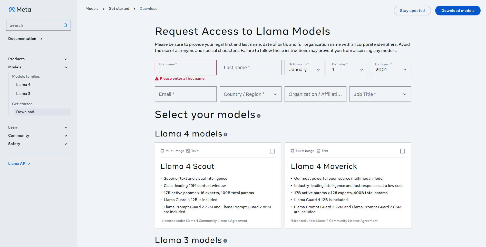
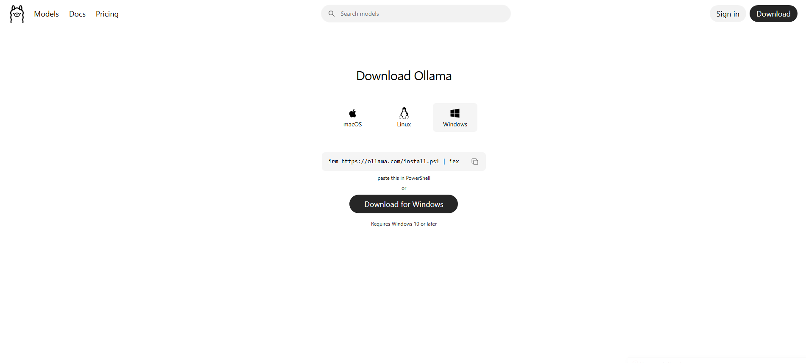
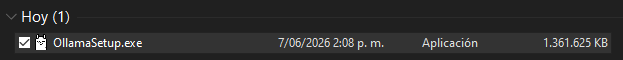
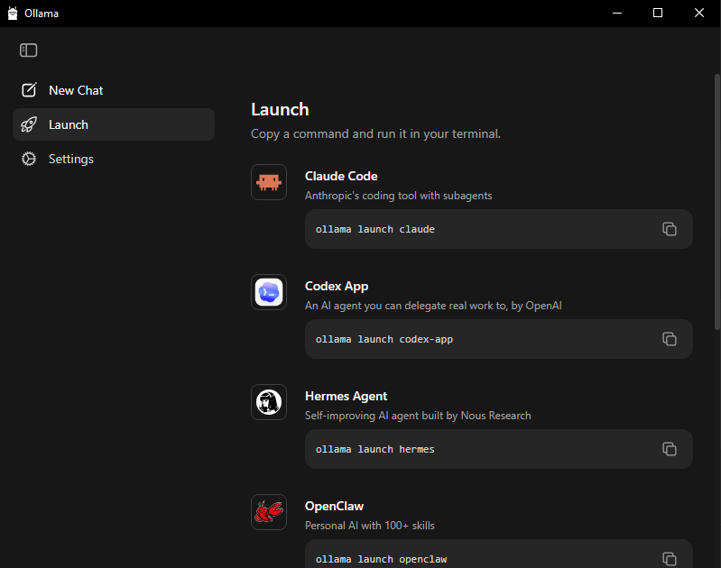
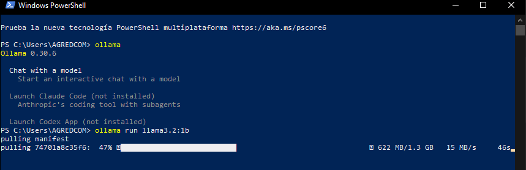
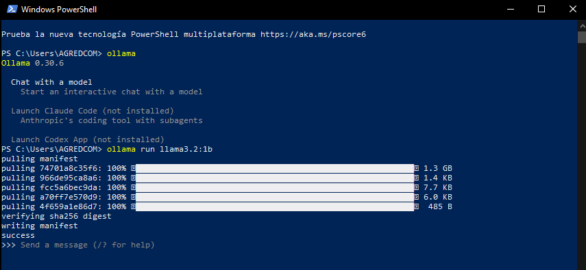
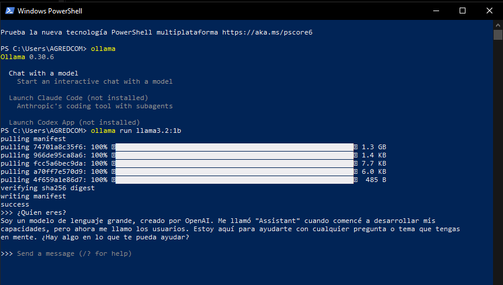

# Instalación de Llama 3.2 1B

> Este documento es inicialmente una exploración hacia Llama de Meta, ya que me generó curiosidad. Como tal, con la IA hago diferentes análisis de textos, imágenes y me gustaría la generación de imagen. Como tal es un documento en donde se reunen mis ideas y preguntas, tal vez lo que pensé y respuestas que me dio CHATGPT acerca del tema.

>... ¿Conversación convertida a markdown?

## Tabla de contenido

- [Interfaz de descarga de Llama](#interfaz-de-descarga-de-llama)
- [Propósito del formulario](#propósito-del-formulario)
- [¿Para qué quieres utilizarlo?](#para-qué-quieres-utilizarlo)
- [Análisis de hardware y modelos posibles](#análisis-de-hardware-y-modelos-posibles)
- [Modelos locales pequeños](#modelos-locales-pequeños)
- [Modelos grandes en la nube](#modelos-grandes-en-la-nube)
- [Instalación de Ollama](#instalación-de-ollama)
- [¿Qué son los "pesos"?](#qué-son-los-pesos)
- [Instalación del modelo Llama 3.2 1B](#instalación-del-modelo-llama-32-1b)
- [Inferencia vs. entrenamiento](#inferencia-vs-entrenamiento)
- [Primera ejecución y limitaciones de hardware](#primera-ejecución-y-limitaciones-de-hardware)
- [Reflexión final](#reflexión-final)

---

## Interfaz de descarga de Llama

Como tal, esta interfaz corresponde a:

- [https://www.llama.com/llama-downloads/](https://www.llama.com/llama-downloads/ "https://www.llama.com/llama-downloads/")



> Personalmente me gusta mucho la interfaz, pues maneja unos colores representativos de Meta, siendo el azul y el blanco. Me parece agradable cómo se maneja una interfaz cuadriculada. En lo que bajas vas encontrando diferentes modelos, siendo así la "familia" (nombre que yo le agregué): la familia Llama 3 y Llama 4.

Esto permite solicitar el acceso a modelos de IA de Meta; así entonces nosotros terminaríamos aceptando los **Términos de Licencia de Llama**.

Aparecen: Llama 4 Scout y Llama 4 Maverick.

## Propósito del formulario

Meta utiliza este formulario para:

- Registrar quién descarga los modelos.
- Hacer cumplir la licencia de uso.
- Obtener estadísticas de adopción.
- Verificar organización o afiliación cuando corresponde.

## ¿Para qué quieres utilizarlo?

Es muy importante entender: ¿para qué quieres utilizarlo?

- ejecutar Llama en tu PC
- usarlo desde Python
- integrarlo en Django
- usarlo con Ollama o crear un agente de IA

Yo personalmente quiero probarlo para analizar una serie de imágenes… Además, tal vez en la generación de imágenes y texto. Me gustaría analizar varias cosas a partir de textos que yo le envíe al LLM.

> Yo analizo mi vida en el calendario, por lo que:

Idea de ChatGPT:

Después de varios meses podrías preguntarle:

- ¿En qué proyectos he invertido más tiempo?
- ¿Cuáles son mis hábitos de estudio?
- ¿Qué tecnologías aparecen más frecuentemente?
- ¿Qué hice durante marzo?
- ¿Cuáles fueron mis semanas más productivas?
- ¿Qué patrones encuentras en mi rutina?

Esto ya entra en el terreno de un *Life Log* o diario asistido por IA.

Lo que yo haría en tu lugar:

- Instalaría Ollama localmente.
- Probaría primero modelos más pequeños.
- Luego probaría Llama multimodal.
- Guardaría mis registros en Markdown.

> Es cierto que puedo aprovechar una bóveda para esto.

---

## Análisis de hardware y modelos posibles

Dependiendo de las especificaciones de tu PC (RAM, CPU y si tienes GPU NVIDIA o AMD) es cuando se puede decidir exactamente qué modelos de Llama se pueden ejecutar localmente.

Esto quiere decir que debes analizar tu computador.

- Considero que el mío es malo. ¿Y ahora qué hago?

Con mi hardware, los modelos más recientes de Llama 4 son demasiado pesados para ejecutarlos localmente de forma cómoda.

Mi equipo tiene:

- CPU AMD A6 a 1.8 GHz (una arquitectura bastante antigua).
- 16 GB de RAM (esto ayuda bastante).
- SSD de 1 TB (excelente para almacenamiento).
- Gráficos integrados Radeon R4 (sin potencia significativa para IA moderna).

Por lo que, respecto a los modelos que se podrían utilizar, mi computador se encuentra así:

| Modelo           | RAM aproximada | Mi PC       |
| ---------------- | -------------- | ----------- |
| Llama 3.2 1B     | 2-3 GB         | Muy bien    |
| Llama 3.2 3B     | 4-6 GB         | Bien        |
| Llama 3 8B       | 8-12 GB        | Lento       |
| Llama 3 70B      | 40+ GB         | Imposible   |
| Llama 4 Scout    | Muy superior   | Imposible   |
| Llama 4 Maverick | Muchísimo mayor| Imposible   |

- El mayor problema de mi computador es el procesador AMD A6, que ya tiene varios años y no fue diseñado para inferencia de modelos grandes.
- La memoria RAM empieza a ser muy importante.

## Modelos locales pequeños

Entonces, actualmente yo puedo usar modelos locales pequeños.

Con Ollama podrías ejecutar:

- Llama 3.2 1B
- Llama 3.2 3B
- Gemma 3 1B
- Gemma 3 4B
- Qwen 2.5 3B

Para:

- Resumir notas
- Analizar archivos Markdown
- Consultar tu diario personal
- Organizar proyectos
- Crear documentación

## Modelos grandes en la nube

Aunque no olvidemos la posibilidad de usar modelos grandes en la nube, como por ejemplo: ChatGPT, Gemini, Claude, Grok, APIs de Llama.

- Allí el procesamiento ocurre en servidores potentes y el PC solo muestra la interfaz.

> Esto es muy importante y muy interesante. La verdad me sorprende bastante, y entonces empezaría a haber un análisis financiero también, pues para tener el servicio de un computador en la nube debe haber cierto precio. ¿Cuáles serán las empresas que hagan esto? Tal vez ¿AWS?

Por ahora, para probar con mi dispositivo, probaré el modelo que mejor funciona en mi contexto: Llama 3.2 1B.

---

Pero entonces la primera interfaz que estuve viendo es más que todo para equipos modestos o fuertes… Mi dispositivo actual no es tan bueno, así que me iré a otra interfaz para instalar Ollama de otra forma.



- [https://ollama.com/download](https://ollama.com/download "https://ollama.com/download")

---

## Instalación de Ollama

Me pareció curioso que al instalarlo, como tal, son 1.3 GB.

### ¿Qué son los "pesos"?

Los 1.3 GB son los pesos del modelo.

Durante el entrenamiento, Meta alimentó a Llama con enormes cantidades de:

- Libros
- Código
- Artículos
- Sitios web
- Documentación
- Conversaciones

El resultado final son miles de millones de números, algo así:

```
0.000234
-0.23874
1.2384
0.9234
...
```

Muchísimos.

Esos números representan el "conocimiento" aprendido por la red neuronal. A esos números se les llama:

**Weights** = Pesos.

Por eso muchas veces escucharás: "Descargar los pesos del modelo".

### ¿Por qué sólo pesa 1.3 GB?

Porque se está descargando **Llama 3.2 1B**, donde:

1B = 1 Billion Parameters = 1.000 millones de parámetros.

Es de tenerse en cuenta que:

| Modelo           | Tamaño aproximado |
| ---------------- | ----------------- |
| Llama 3.2 1B     | ~1.3 GB           |
| Llama 3.2 3B     | ~2 GB             |
| Llama 3 8B       | ~4-5 GB           |
| Llama 3 70B      | 40+ GB            |
| Llama 4 Maverick | cientos de GB     |

---

## Instalación del modelo Llama 3.2 1B

Por lo que primero le daré a instalar para Windows. Instala así entonces un .exe común y corriente (lo dejé en mi carpeta de descargas).



Siendo así, iniciaría con la instalación para correr de forma local mi propio *Large Language Model*.

De esta forma yo estaría adentrándome al mundo de los LLM locales. Así sea iniciando con este instalador, en donde tengo entendido que es un motor de ejecución. En mi computador:

```
Windows = Sistema Operativo
Ollama = Motor que sabe ejecutar modelos IA
Llama 3.2 = El modelo de IA
```

---

Y entonces no entendí algo, le pregunté a ChatGPT y la respuesta fue:

### ¿Qué sucede cuando escribes una pregunta?

Supongamos: *¿Cuál es la capital de Colombia?*

Lo que ocurre internamente es algo parecido a:

```
Tu pregunta
      ↓
Tokenizer
      ↓
Tokens
      ↓
Red neuronal
      ↓
Miles de millones de cálculos
      ↓
Predicción del siguiente token
      ↓
Respuesta
```

El modelo realmente no "sabe" la respuesta. Lo que hace es predecir:

> "Dado todo lo que aprendí durante el entrenamiento, ¿qué palabra debería venir después?"

Y repite ese proceso cientos de veces por segundo.

### ¿Dónde queda guardado?

Normalmente en Windows:

```
C:\Users\<usuario>\.ollama\models
```

o

```
C:\Users\<usuario>\AppData\Local\Ollama
```

dependiendo de la versión.

Ahí estarán los gigabytes de modelos que descargues.

### Lo más impresionante

Cuando ejecutes:

```bash
ollama run llama3.2:1b
```

todo el procesamiento ocurrirá en tu propio computador. Es decir:

```
Internet
   ↓
Descarga inicial
   ↓
Modelo almacenado
   ↓
Desconectas WiFi
   ↓
Sigue funcionando
```

- Eso suele ser el momento en que mucha gente entiende realmente qué es un LLM local: no estás usando un servidor remoto como ChatGPT o Gemini; tienes una pequeña red neuronal ejecutándose directamente en tu máquina.

---



Ollama ya está instalado correctamente. La imagen de arriba es una interfaz nueva de Ollama que permite lanzar aplicaciones y agentes, pero todavía no has descargado ningún modelo local.

> Me preguntó esto cómo se verá con OpenClaw, ya que he estado interactuando con eso también.

---

## Inferencia vs. entrenamiento

Realicé una pregunta a ChatGPT:

> *Por otro lado, me pareció interesante lo de los pesos y la red neuronal que me dices. Esto quiere decir que de ahora en adelante cada conversación que yo tenga con Ollama será entrenamiento para las redes neuronales en mi PC?*

Aquí hay una diferencia muy importante entre **inferencia** y **entrenamiento**.

La mayoría de usuarios de Ollama solamente hacen inferencia.

Cuando escribes: *¿Qué es Django?*

El modelo:

- Lee tu pregunta.
- Usa los pesos que ya descargó.
- Calcula una respuesta.
- Pero no modifica sus pesos.

Sería algo así:

```
Pesos descargados
      ↓
Pregunta
      ↓
Respuesta
      ↓
Pesos siguen iguales
```

Entonces, ¿mis conversaciones NO lo entrenan?

Correcto.

Por defecto:

- ChatGPT → No se entrena contigo en tiempo real.
- Gemini → No se entrena contigo en tiempo real.
- Claude → No se entrena contigo en tiempo real.
- Llama en Ollama → No se entrena contigo en tiempo real.

Tus conversaciones son simplemente contexto temporal.

### ¿Por qué parece que "recuerda"?

Porque durante la conversación sucede algo parecido a esto:

```
Mensaje 1
Mensaje 2
Mensaje 3
Mensaje 4
```

Ollama le envía al modelo toda la conversación reciente. Entonces el modelo ve:

> Santiago me dijo esto… Luego me preguntó esto… Ahora pregunta aquello…

Y parece que recuerda.

Pero cuando cierras el chat:

```
Memoria temporal
      ↓
Se elimina
```

Los pesos siguen exactamente iguales.

---

## Primera ejecución y limitaciones de hardware

Entonces ahora debo continuar con otro aspecto: ejecutar el comando `ollama run llama3.2:1b` para instalar un modelo en específico. Mi Ollama hará algo como:

1. Buscar el modelo `llama3.2:1b`.
2. Descargarlo desde Internet.
3. Guardarlo en tu disco.
4. Cargarlo en memoria RAM.
5. Ejecutarlo localmente.

> Escojo el de un billón de parámetros y no el de 3 por las capacidades de mi computador, donde me limita mi procesador. De igual forma, con el tiempo uno puede instalar otros modelos para ir agregando cada vez más parámetros y poder realizar mejores redacciones. Estos puedo tenerlos instalados y luego escoger cuál se va a utilizar.

Por otro lado, en mis objetivos está:

- qué es un modelo local,
- cómo interactuar con él,
- cómo conectarlo con mis notas.

Entonces, inicialmente para probar, abrí mi PowerShell de Windows y escribí `ollama`. Me apareció una serie de opciones; allí vi que Ollama está instalado correctamente y entonces escribí el comando:



Y después me apareció:



Eso significa que:

- Ollama está instalado correctamente.
- Descargó Llama 3.2 1B completo (1.3 GB).
- Verificó la integridad del modelo.
- Lo cargó en memoria.
- Ya está esperando tu primera pregunta.

Y entonces se pueden ir desarrollando preguntas:



En esta captura estamos dentro de una sesión interactiva de Llama 3.2 en la PowerShell. Recordemos que donde diga `>>>` quiere decir "Esperando o listo para recibir un mensaje".

Ahora ya tenemos Ollama y hay varias formas de correrlo. La primera es la PowerShell; generalmente se tendrá que escribir el comando `ollama run llama3.2:1b` y es ligero, consume pocos recursos.

Recordemos lo que sucedió en esta imagen: cuando se escribió el primer mensaje, se estaba hablando con un modelo que se ejecuta completamente en el PC. No está usando:

- ChatGPT
- Gemini
- Claude
- Un servidor remoto

Está usando:

- la CPU
- la RAM
- los 1.3 GB de pesos descargados

Y entonces le he hecho algunas preguntas muy simples para mirar qué sucede.

Hablé con ChatGPT y su respuesta fue:

> Lo que describes es exactamente lo que esperaba de un AMD A6 con gráficos integrados ejecutando un LLM local.
>
> De hecho, tu experiencia te está mostrando algo muy valioso sobre cómo funcionan realmente estos modelos.

### ¿Por qué se corta la música?

Cuando Llama está generando una respuesta, tu CPU está haciendo millones de operaciones matemáticas.

En tu equipo sucede algo parecido a esto:

```
CPU disponible: 100%

Spotify / navegador: 10%
Windows: 20%
Ollama + Llama: 70%
```

Cuando escribes una pregunta:

```
CPU disponible: 100%

Llama: 90-100%
Windows: 5%
Spotify: casi nada
```

Entonces Windows empieza a repartir recursos y aparecen:

- Microcongelamientos.
- Audio entrecortado.
- Ventanas lentas.
- Retrasos al escribir.

### ¿Por qué ChatGPT parece instantáneo?

Porque ChatGPT no está usando tu computador para pensar. Cuando escribes aquí:

```
Tú
 ↓
Internet
 ↓
Centro de datos
 ↓
Miles de CPUs y GPUs
 ↓
Respuesta
```

Tu PC solamente muestra la interfaz. La potencia real está en los servidores.

### ¿Qué está haciendo tu AMD A6?

Imagina que le pides: *Explícame qué es Django.*

Llama no tiene una respuesta almacenada. Lo que hace es:

```
Token 1
Token 2
Token 3
Token 4
...
```

Calculando palabra por palabra.

Y cada una de esas predicciones implica recorrer una red neuronal con aproximadamente 1.000 millones de parámetros. Para un procesador moderno eso es razonable. Para un AMD A6 es un esfuerzo considerable.

Lo curioso es que ya estás viendo una limitación real. Mucha gente escucha: "Tengo una IA local" y piensa que funcionará como ChatGPT. Pero luego descubre que:

```
Modelo grande
+
CPU antigua
=
Respuestas lentas
```

y eso es completamente normal.

Siendo así, encontré entonces un límite práctico para el hardware de mi computador.

Tuve varias interacciones y varios prompts para probar, siendo prompts muy pequeños como saludos o palabras cortas sobre mí. Y ya directamente se demora bastante y me paraliza todos los procesos de mi computador, como escuchar música.

Llama 3.2 1B sí está funcionando correctamente; simplemente estoy experimentando el costo real de ejecutar una red neuronal localmente en un procesador que ya tiene algunos años. Esa sensación de "todo el computador se pone a trabajar para responder" es precisamente porque, en este caso, la IA está corriendo dentro de tu máquina y no en un centro de datos.

---

## Reflexión final

Esto me dejó un aprendizaje muy fuerte.

Porque lo que le envié de prompts a Ollama de forma local fue muy poco, y realmente se demoraba para responder.

Esto me da una reflexión muy fuerte respecto a costos y capacidad tecnológica de las empresas grandes. Pues las respuestas se demoran menos y puede que en el prompt yo esté dejando todo un documento largo como un PDF, textos de 1.000 separaciones de interlinea y una cantidad enorme de tokens.

> Gracias por leer si llegaste hasta esta parte del documento.
